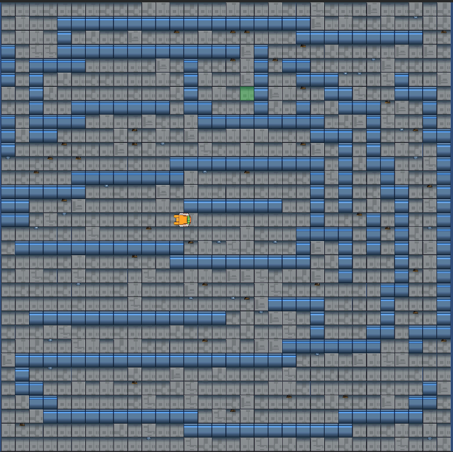
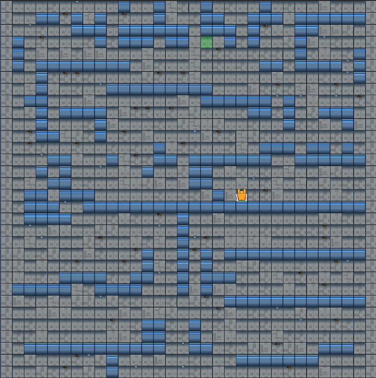
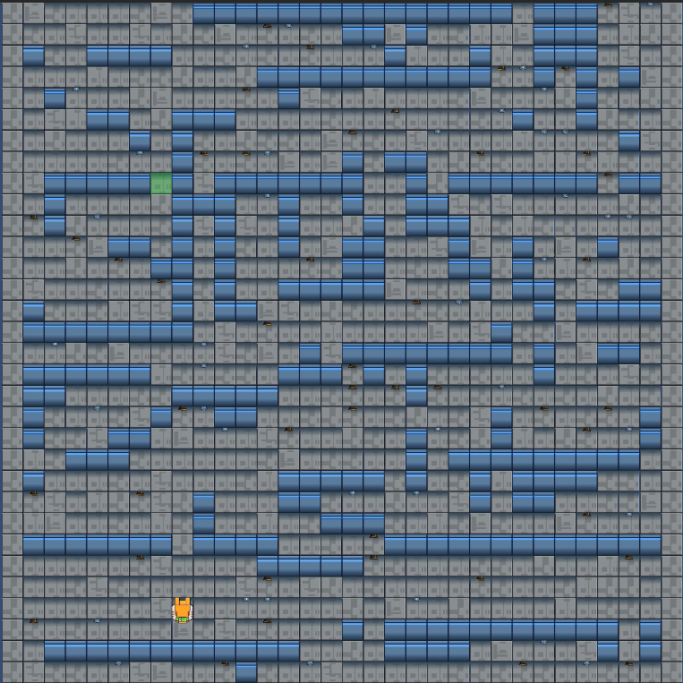
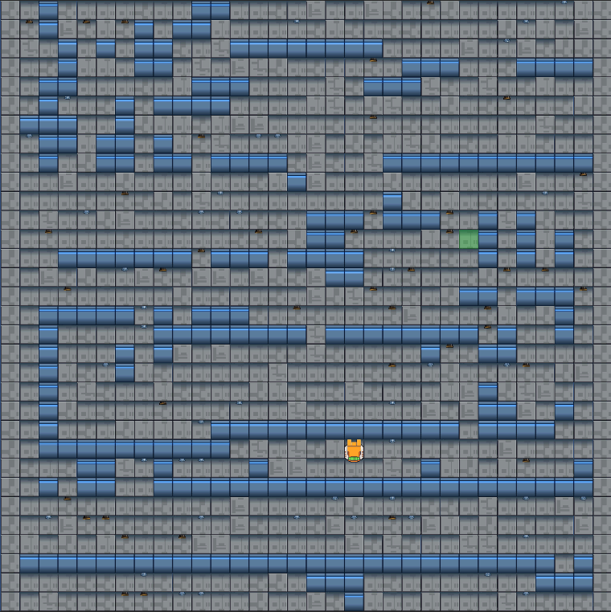
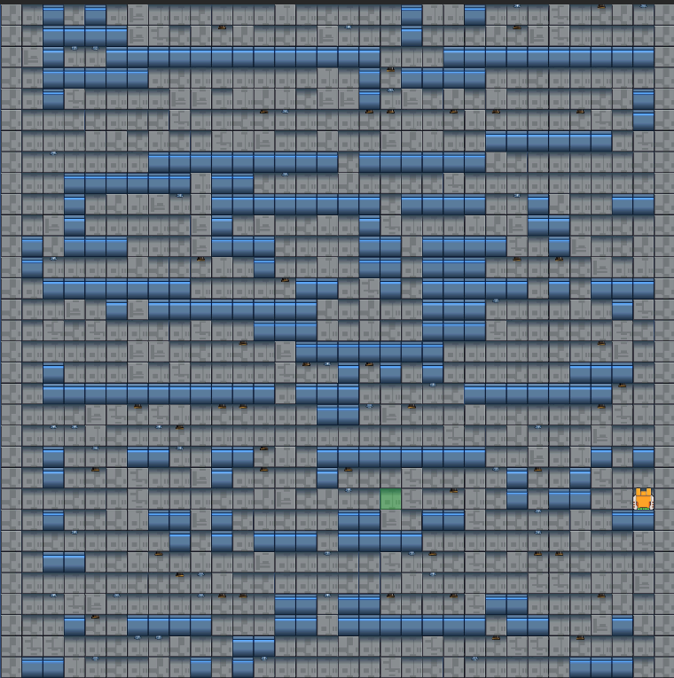
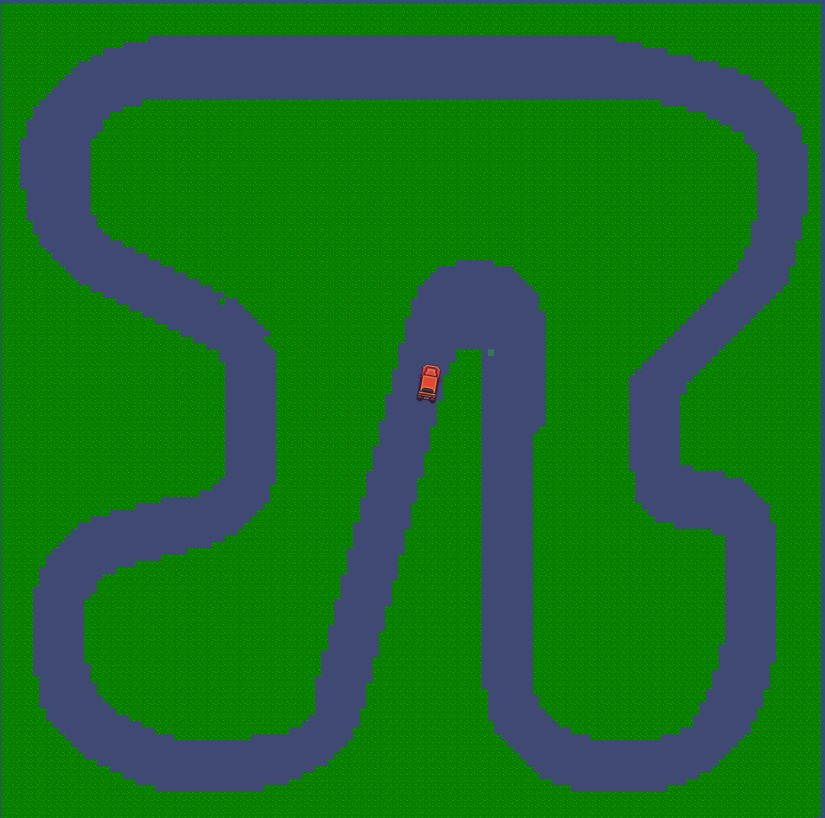
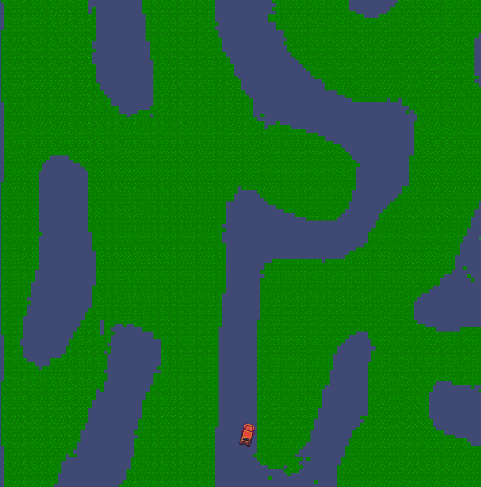
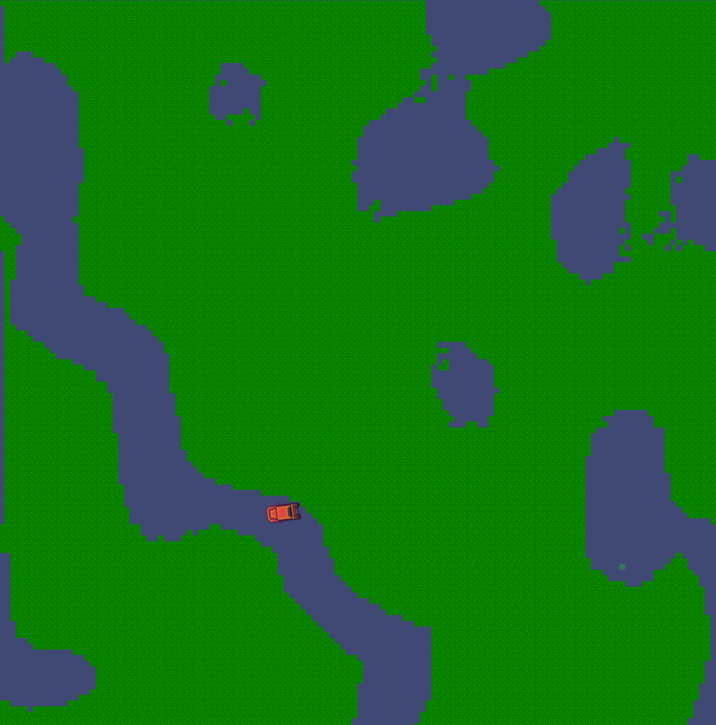
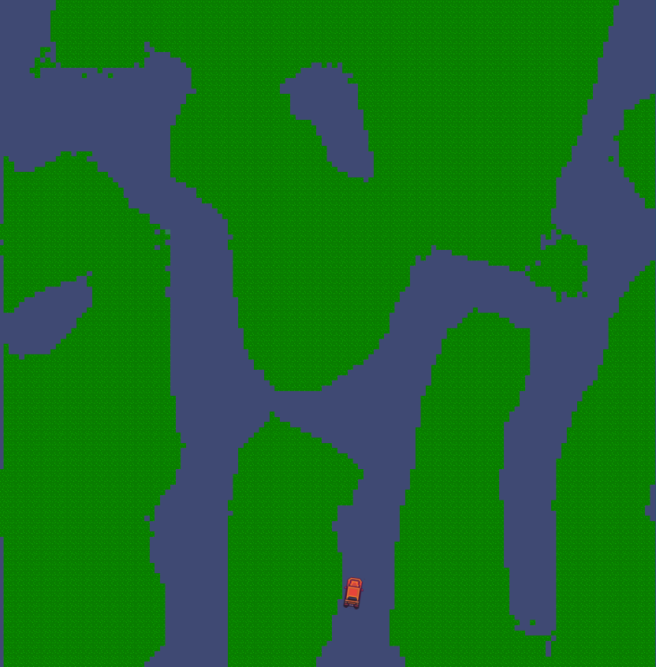
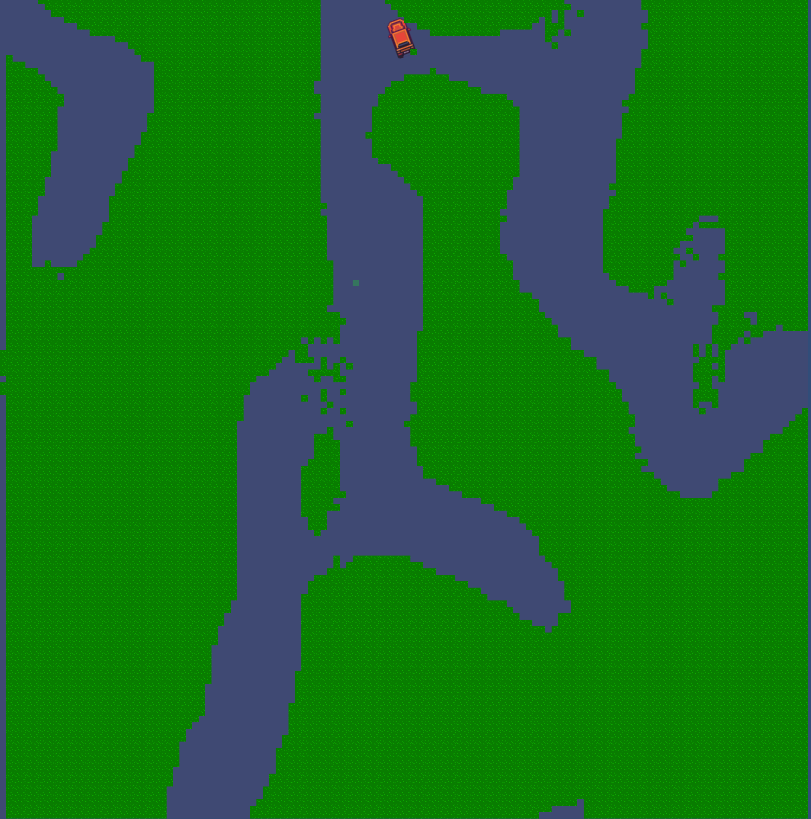

# Simulator GAN

The goal of this research project is to utilize GANs to generate simulation environments which help in finding faults in robot control systems.
Generally, procedural generation algorithms and genetic algorithms are used for generating such environments. 

We are using a variation of the [SinGAN](https://arxiv.org/abs/1905.01164) which only requires a single input to train the model. We also were inspired by the [TOAD-GAN](https://arxiv.org/abs/2008.01531) paper 
which developed a token based approach for the input of their model.

We are also using Unity to generate inputs for our model and to visualize and test generated environments.

## Examples
Here are some examples of some preliminary testing:
- **Input**

- Output

- **Input**

- Output

## Simulation Metrics

- Simulation time
- Risk score:
  - Number of collisions
  - Proximity time
- Pattern KL-Divergence (Need to be small)
- Map uniqueness (Need to be high)
- Map complexity
  - Empty map percentage
  - Energy distribution
- Simulation completed?

## Next Steps

- Implement a genetic evolution algiorithm to improve the fault-revealing power of the environment generator
- Implement the option of having more than a single input
- Add quantitative evaluation metrics
- Implement robot control softwares in python (Currently only implemented in Unity), or use headless unity