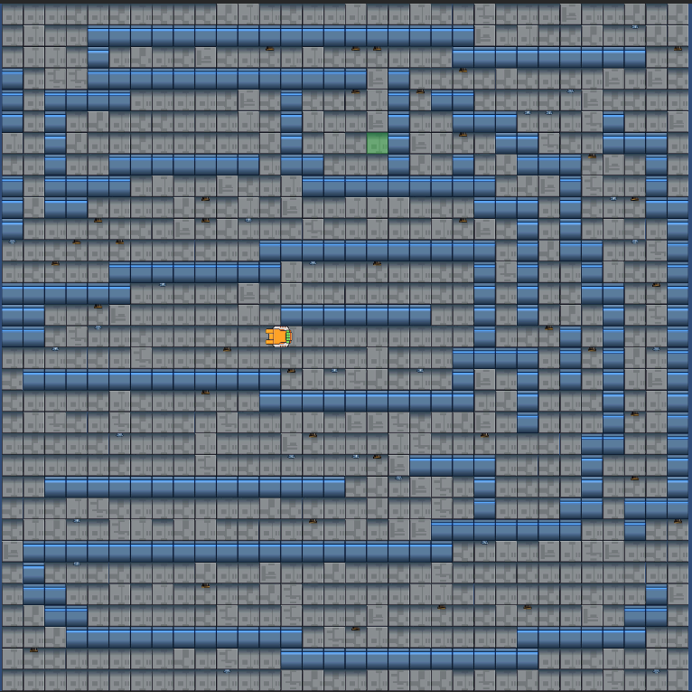
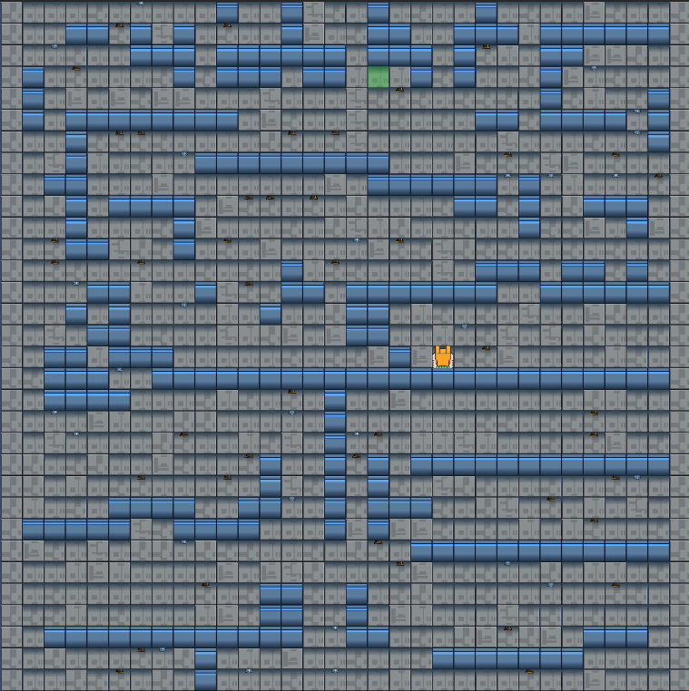
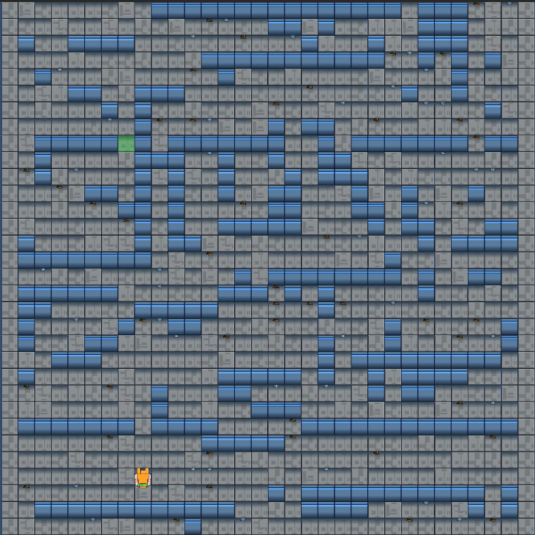
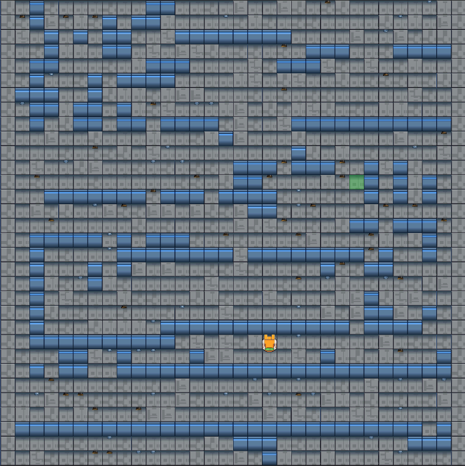
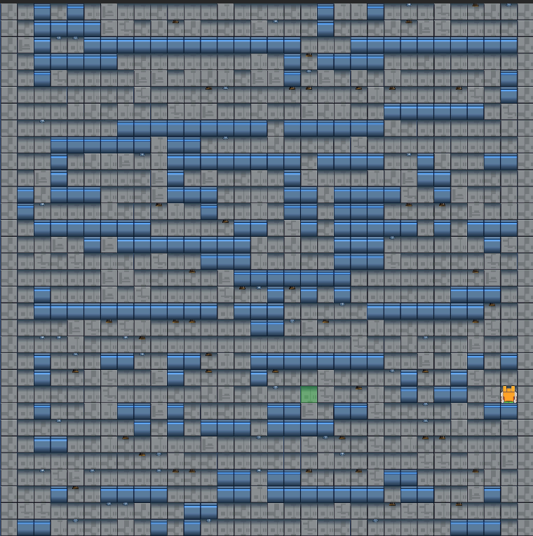
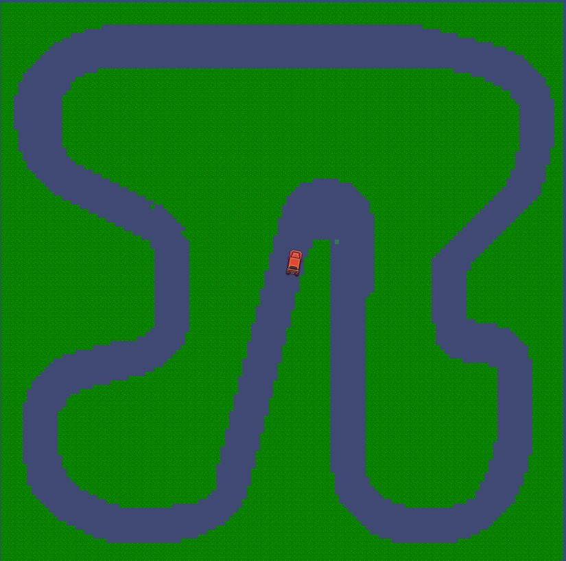
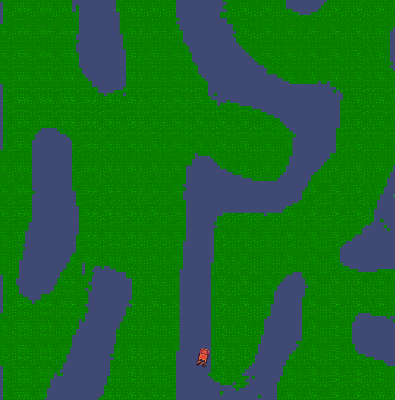
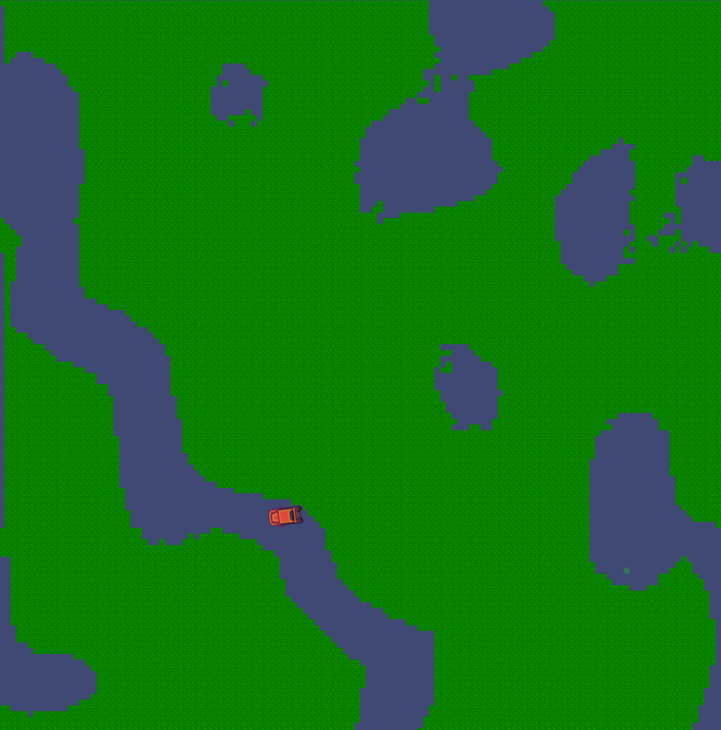
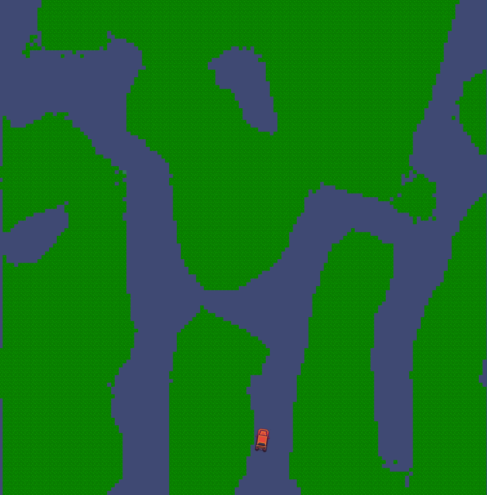
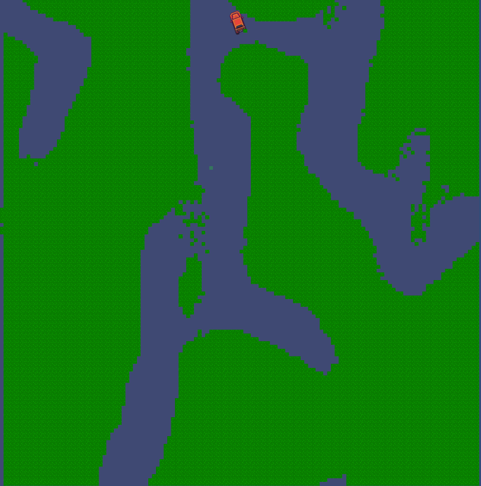

# Simulator GAN

The goal of this research project is to utilize GANs to generate simulation environments which help in finding faults in robot control systems.
Generally, procedural generation algorithms and genetic algorithms are used for generating such environments. 

We are using a variation of the [SinGAN](https://arxiv.org/abs/1905.01164) which only requires a single input to train the model. We also were inspired by the [TOAD-GAN](https://arxiv.org/abs/2008.01531) paper 
which developed a token based approach for the input of their model.

## Examples
Here are some examples of some preliminary testing:
- **Input**

- Output

- **Input**

- Output

